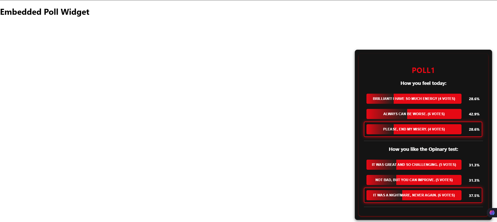

# Poll Widget

A fully responsive and interactive Poll Widget built using **React + TypeScript** with **localStorage persistence**. This widget allows users to vote on questions, view live results with animated progress bars, and embed it in standalone HTML pages.

🔗 **Live Demo:** [Poll Widget](https://poll-widget.vercel.app/)

🖼️ **Screenshot:**


---

## 🚀 Features

- **Vote Persistence:** Stores votes in `localStorage`, so they remain after refresh.
- **Real-Time Progress:** Updates percentages dynamically with animated bars.
- **One Active Question at a Time:** Selecting an option in one question removes the highlight from others.
- **Netflix-Themed UI:** Uses a dark red and black color scheme.
- **Standalone Embed:** Can be used in other HTML pages with `<script>` integration.
- **Unit Tested:** Includes Jest + React Testing Library tests.
- **Code Quality:** Implemented **Husky, Prettier, and ESLint** for code formatting, linting, and pre-commit checks.

---

## 🛠️ Technical Choices & Decisions

- **React + TypeScript:** Ensures type safety and scalability.
- **LocalStorage for Vote Persistence:** Enables users to retain their votes after a refresh without requiring a backend.
- **Component-Based Design:** Each part of the widget (PollWidget, Question, AnswerOption) is modular and reusable.
- **CSS Modules for Styling:** Prevents class name conflicts and keeps styles scoped.
- **Jest + React Testing Library:** Ensures functionality and UI consistency through unit tests.
- **Standalone Integration:** The widget can be embedded into any HTML page without requiring React on the host page.
- **Husky, Prettier, and ESLint:** Enforces code quality, consistency, and formatting before commits.

---

## 🔍 Potential Improvements

- **Backend API Integration:** Store votes in a database instead of `localStorage` for better scalability.
- **WebSocket Updates:** Enable real-time vote synchronization across users.
- **Improved UI Animations:** Enhance the voting experience with smoother transitions and effects.
- **Accessibility Enhancements:** Improve keyboard navigation and screen reader support.

---

## 📦 Installation & Setup

### **1️⃣ Clone the Repository**

```sh
git clone https://github.com/your-repo-url.git
cd poll-widget
```

### **2️⃣ Install Dependencies**

```sh
npm install  # or yarn install
```

### **3️⃣ Run the Development Server**

```sh
npm start  # or yarn start
```

The widget will be available at `http://localhost:3000/`.

### **4️⃣ Build the Widget for Production**

```sh
npm run build  # or yarn build
```

This generates production files in the `build/` directory.

---

## 🛠️ Usage

### **Embedding Poll Widget in an HTML Page**

You can use this widget **without React** in standalone HTML pages.

### **1️⃣ Include the Widget in an HTML Page**

Create `poll_page.html` and add the following:

```html
<!DOCTYPE html>
<html lang="en">
  <head>
    <meta charset="UTF-8" />
    <meta name="viewport" content="width=device-width, initial-scale=1.0" />
    <title>Poll Widget</title>
    <link rel="stylesheet" href="./build/static/css/main.css" />
    <style>
      #poll-container {
        position: fixed;
        bottom: 20px;
        right: 20px;
        width: 500px;
        background-color: #141414;
        padding: 15px;
        border-radius: 10px;
        box-shadow: 0px 4px 10px rgba(0, 0, 0, 0.5);
      }
    </style>
  </head>
  <body>
    <h1>Embedded Poll Widget</h1>
    <div id="poll-container"></div>
    <script src="./build/static/js/main.js"></script>
    <script>
      window.onload = function () {
        if (window.PollWidgetLibrary) {
          PollWidgetLibrary.mountPollWidget('poll-container', 'poll1')
        } else {
          console.error('PollWidgetLibrary is not loaded')
        }
      }
    </script>
  </body>
</html>
```

### **2️⃣ Open the HTML File**

Open `poll_page.html` in a browser to see the widget in action.

**🔹 If you see your old submissions, clear the localStorage, refresh, and use the poll again.**

---

## ✅ Running Tests

The project includes **unit tests** for key components using **Jest + React Testing Library**.

### **Run All Tests**

```sh
npm test
```

### **Run Tests for a Single Component**

```sh
npm test src/components/PollWidget.test.tsx
```

### **Fix Tests Automatically**

```sh
npm run test -- --watch
```

---

## 📁 Project Structure

```plaintext
poll-widget/
│── src/
│   ├── components/       # UI Components (PollWidget, Question, AnswerOption)
│   ├── data/             # Poll data (pollData.ts)
│   ├── types/            # TypeScript interfaces (Poll.ts)
│   ├── App.tsx           # Main React Application
│   ├── constants.ts      # Global constants
│   ├── index.tsx         # React entry point
│── public/               # Static files (includes image.png for README)
│── build/                # Production build (after `npm run build`)
│── tests/                # Jest & React Testing Library tests
│── package.json          # Dependencies & scripts
│── README.md             # This documentation
```

---

## 📌 Notes

- The widget **automatically loads votes from `localStorage`**.
- Clicking an option **updates the vote count and progress bar in real-time**.
- **One question is active at a time**—selecting a new question removes selection from the previous one.
- **Unit tests ensure stability**—run `npm test` before deployment.

---

## ✨ Contribution

Feel free to contribute by creating a pull request! If you encounter any issues, please open a GitHub issue.

---

## 🎯 Next Steps

🔹 **Enhance UI:** Add animations.  
🔹 **API Integration:** Replace `pollData.ts` with a backend API.

---

## 📝 License

MIT License. Free to use and modify.

**🚀 Built with React, TypeScript, and Passion!** 🎬🔥
